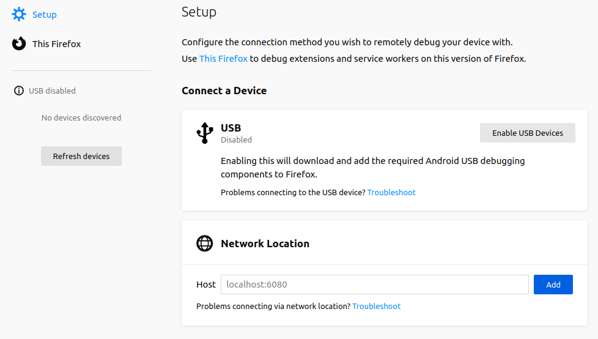
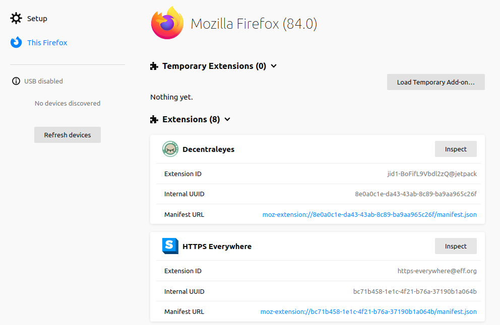

# Easy Signature

A Firefox extension for easy inserting of email-like signatures into textarea fields. The signature is configurable in an extension popup and can be inserted via a new entry in the textarea context-menu.

## Installation

### Releases

I plan to make releases available at the *Firefox Extension Workshop* once the `v1.0-alpha` release candidates have been validated to be mature. Until then, you can test pre-releases following the instructions below.

### Pre-Releases

The pre-releases can be installed by downloading the corresponding ZIP release file (see the [Releases](https://github.com/dy5function/easy-signature/releases) page of this repository). Unpack the ZIP at a location of your choice. Afterwards, open your Firefox browser and go to the special privilege page [about:debugging](about:debugging).

Click on [This Firefox](about:debugging#/runtime/this-firefox) to follow the link to the local browser debugging page (alternatively, use the link provided in this instruction - note that the link is only expected to work on the Firefox browser). On the debugging page, you should see a list of all your extensions. Above this list should be a (probably empty) section titled **Temporary Extensions**.

Use the *Load Temporary Add-on...* button and select the `manifest.json` file from the unpacked ZIP archive that you downloaded to activate the *Easy Signature* extension temporarily. The extension will remain active until you close Firefox. Note that any data stored by the extension will be lost once Firefox is closed with this temporary installation (this will not be the case for a release installation from the *Firefox Extension Workshop*).

## Usage

Once you have loaded the extension, a new icon should be available in your Firefox toolbar (top-right, next to the menu icon) where you can open the extension popup to configure your signature. The signature can be appended at the end of an already typed message in a multiline input field on any webpage via the right-click context-menu entry *Append Signature*.

## Bugs and Issues

First of all, if you are taking the time to install and use this extension - thank you very much! This extension is provided with the hope of it being useful. That being said, although I have made an effort to test this extension thoroughly, there may be bugs or any part of the extension may behave differently to what you may expect. If you find any issues with this extension, you can help improve it by creating an issue on this repository: [https://github.com/dy5function/easy-signature/issues](https://github.com/dy5function/easy-signature/issues).
